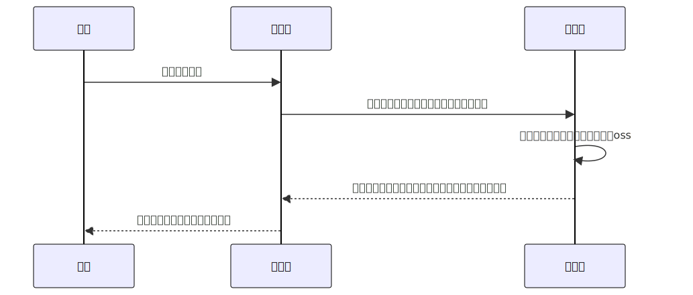

---
tags:
  - 公众号
  - 项目
categories:
  - 公众号
---

# 记录通过个人公众号下载微信表情包项目失败告终过程

起因微信中有很多有趣的表情包，在其他软件上想用时却找不到下载按钮。偶然发现一些公众号可以下载微信收藏的表情包。从而想通过个人公众号将表情包下载到本地。

### 项目流程图



根据上图流程建立起了服务端，并且对接了公众号接口校验、通知事件、解析 xml 的功能。但是在公众号发送表情包消息时，服务端接收不了表情包，经过网上文章的探查，微信公众号通知的消息是不支持表情包。服务端会收到`[收到不支持的消息类型，暂无法显示]`的消息。可是别人的公众号为什么能提供下载表情包的能力呢？又经过一番网上文章的搜查，发现了两种方法。一种是爬虫，一种是利用公众号客服的能力。

1.  爬虫获取表情包。(个人可做)

开发者服务器接收公众号通知的消息事件里的内容是没有表情包内容的。可是在小程序后台的私信功能上可以看到用户发的消息，包括表情包。到这里我们就想到了爬虫的方式去获取表情包。但是爬虫是需要处理鉴权、数据获取、获取表情包数据的接口所需要的数据获取，还要考虑怎么做到自动化处理整个流程。开发时间周期长，而且不一定能成功，毕竟不知道会不会出现封禁的风险。

2. 公众号客服能力获取表情包。（公众号需要认证）

根据公众号的文档，是可以将用户发送的消息转发到指定客服上的，还能通过提供的接口能力获取客服的历史消息。按照这个流程轻松就能获取到用户的表情包消息，并且还不用自己存储表情包，成本大大降低。但是这个能力是需要公众号认证的。个人公众号基本无望。

### 结论

发现提供下载表情包的公众号，都是公司主体，没发现个人主体。基本就宣告了个人公众号开发开发此功能基本无望。不过可以尝试一下爬虫方式，就是会有点麻烦。我就不折腾了，要保住自己的微信号(现在注册微信号太难了)。虽然没能把这个项目做起来，但是开发过程中还是有一点收获的。

### 收获

1. 公众号填写服务器信息时，需要填写服务器的 url、token 等信息，在提交时会发`get`请求到填写的 url 上，开发者服务器需要做好校验处理，校验成功后需要将`query`接收的`echostr`返回给公众号服务器，才能提交成功。不能像[文档实例代码](https://developers.weixin.qq.com/doc/offiaccount/Basic_Information/Access_Overview.html#%E6%8E%A5%E5%85%A5%E6%A6%82%E8%BF%B0)一样返回`true`，否则不能提交服务器信息。
2. 接收公众号通知的消息时，需要注意消息是 xml 数据，不能通过`query`、`body`、`params`的方式获取。需要监听`data`事件，获取二进制数据并且通过`toString`方法转换成字符串数据，然后才能解析 xml 数据。

```javascript
// 这是midway 框架的示例代码
this.ctx.req.on("data", async (data) => {
  const xmlData = data.toString();
  console.log("xmlData ----", await parseStringPromise(xmlData));
});
```
