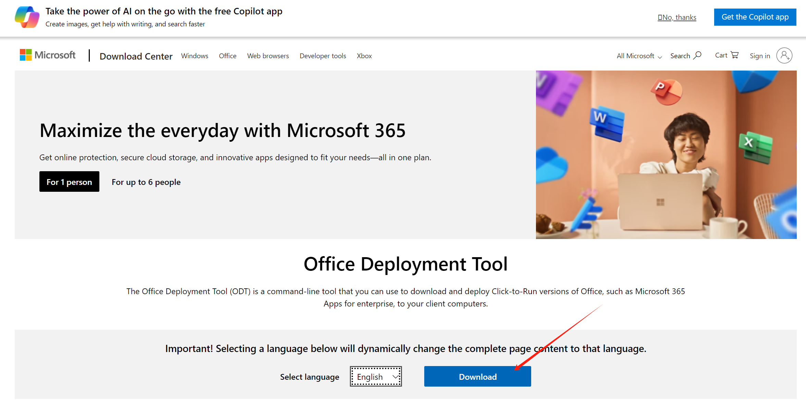
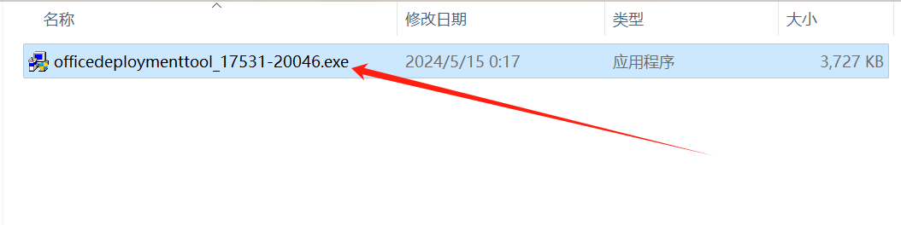
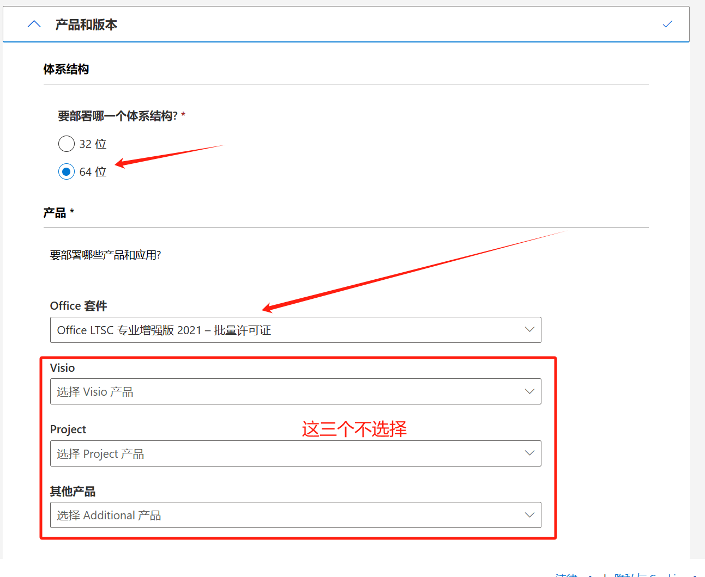
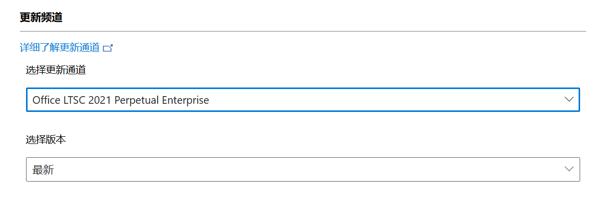
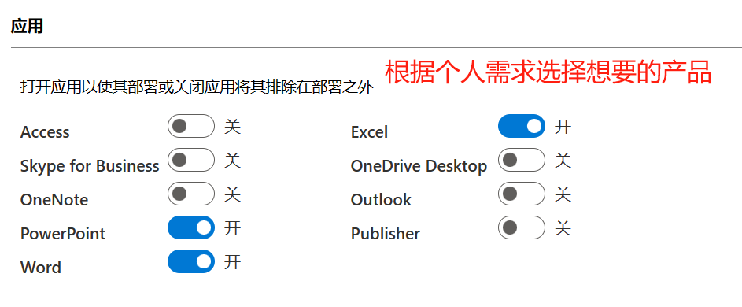
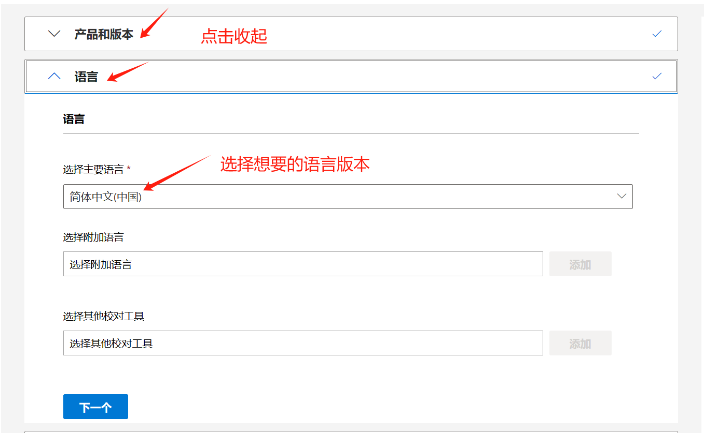
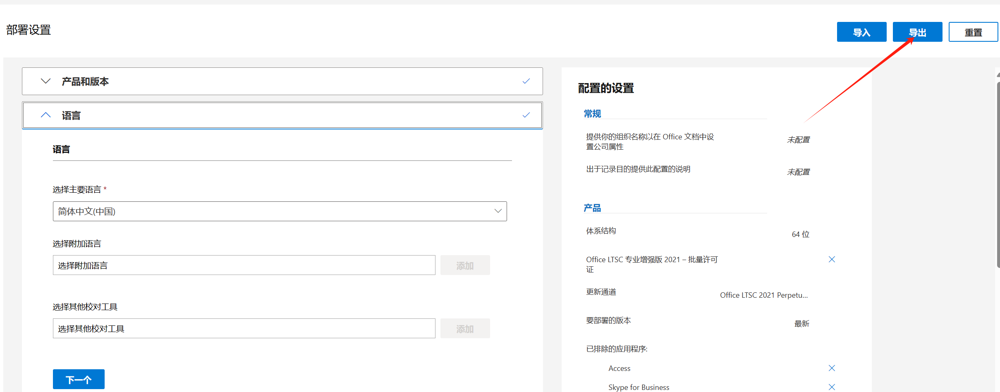
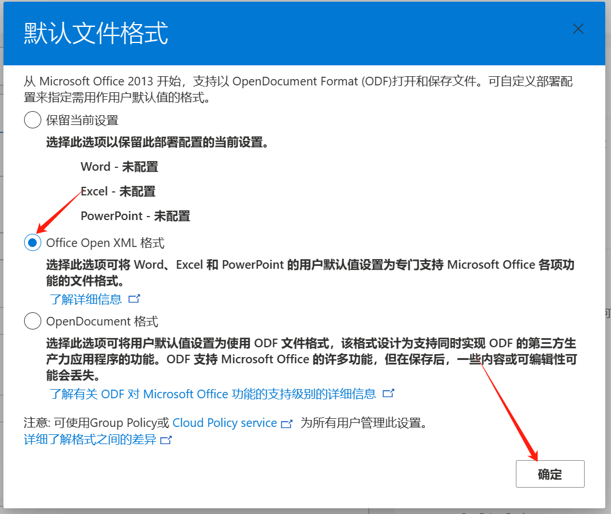
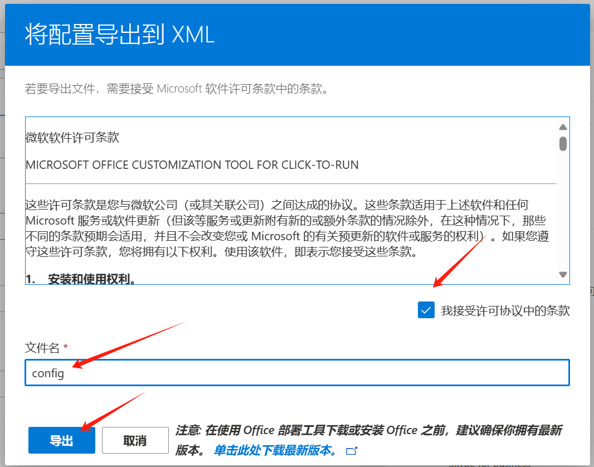

---
tags:
  - windows
  - office
categories:
  - office
---

# Windows 安装官方 office2021 版本永久免费

常见的办公软件包括 Word、Excel 和 PPT，几乎所有公司都会使用。在国内，大多数人都会使用 WPS 软件，它简单且具有云存储能力。但是它采用了会员购买制度，许多功能需要升级为会员后才能使用。国外的 Office 软件也需要付费，采用许可证购买永久使用制度。作为一个遵循“能省则省”原则的普通人，我找到了一种可以免费使用 Office 的方法。

::: tip
💡 可以使用`Edge浏览器`打开后面内容的链接，在下载文件的时候会提高**下载速度**。
:::

## 下载与安装

- **下载安装工具:**
  - [**https://www.microsoft.com/en-us/download/details.aspx?id=49117**](https://www.microsoft.com/en-us/download/details.aspx?id=49117)
  - **打开下面链接，直接点击 download**
    
- **在找一个合适的文件夹，例如: F:\office (F 盘下的 office 文件夹，可以自己新建一个文件夹)，将下载好的安装工具移动到文件夹内。**
- **双击安装工具，同意协议，安装目录选择当前的文件夹位置。**
  
- **下载配置**
  - [**https://config.office.com/deploymentsettings**](https://config.office.com/deploymentsettings)
  - **产品结构根据自己系统选择（这里选择：`64位`）**
  - **产品选择 office 套件：`Office LTSC 标准版 2021 - 批量许可证` （其他产品看情况选择，这里只需要 offiice）**
    
  - **更新频道不用修改，保持默认**
    
  - **应用可以只选择`Excel`、`PowerPoint`、`Word`，其他的软件看个人需求，需要的可以选上**。
    
  - **语言选择 `简体中文`。(如果喜欢其他语言可以选择其他语言)**
    
  - **点右上角的导出**
    
  - **导出选项选择 XML**
    
  - **接收协议，配置 改为 `config`**
    
  - **导出到上面安装 office 的文件夹**
- **输入命令安装 office**

  - **打开终端: `win`+`R`, 输入：`cmd`，回车**
  - **切换到上面的目录（F:\office）**
  - 依次输入以下两个命令

  ```bash
  # 下载安装文件
  setup.exe /download config.xml

  # 安装
  setup.exe /configure config.xml**
  ```

- **激活**

  - 在搜索框输入：`命令提示符`，右键选择管理员
  - 切换到 office 的安装目录
    - 32 位系统：`cd C:\Program Files(x86)\Microsoft Office\Office16`
    - 64 位系统：`cd C:\Program Files\Microsoft Office\Office16`
  - 输入激活命令

  ```bash
  cscript ospp.vbs /sethst:kms.03k.org

  cscript ospp.vbs /act**
  ```

- **激活成功后，打开 word，点击账号就可以看见激活成功。**

# 可能遇到的问题

1. 最后一步出现了`Error Code: 0x80080005`错误
2. 原因：可能以前就安装过 office，或者是之前安装的 office 是用激活软件激活的。
3. 解决方法：卸载以前安装的 office，并重新按上面步骤重新安装 office，然后进入注册表，将`KEY_LOCAL_MACHINE\SOFTWARE\Microsoft\Windows NT\CurrentVersion\Image File Execution Options\SppExtComObj.exe`删除，重新输入激活命令。
