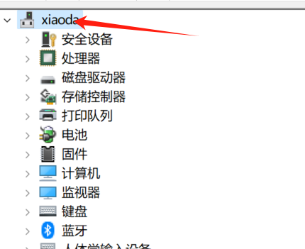

---
tags:
  - windows
  - 驱动
categories:
  - windows
---

# windows 如何安装驱动

在使用 windows 电脑时，有可能会出现某个驱动损坏，丢失的情况。或者是自己手痒重装了 windows 系统，需要重新安装驱动。驱动下载安装可以使用`驱动精灵` 等第三方软件，但是想要自己下载驱动并安装，则需要在对应的电脑品牌商提供的网站上下载(其他下载路径也可以)。下载后的驱动如何安装？其实是很简单的。

## 方法

- 搜索框输输入`设备管理器` ，打开。
- 选中这台设备的名字，右键->添加驱动程序

- 选择下载好的驱动，如果驱动是压缩包，选择前需要先解压。
- 添加完所有驱动就重启电脑。
